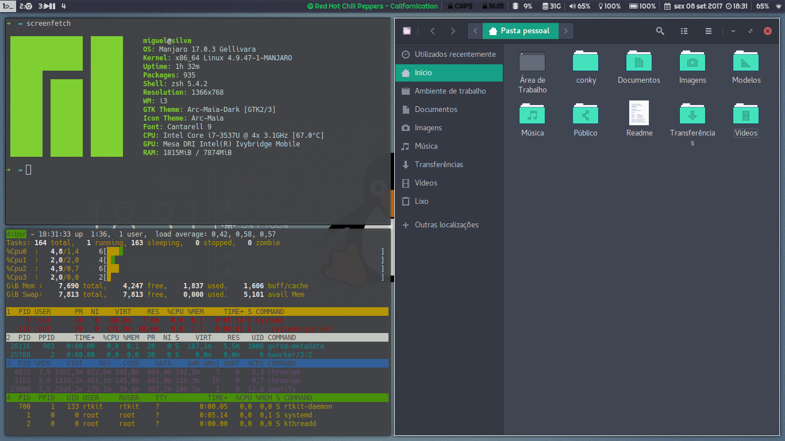
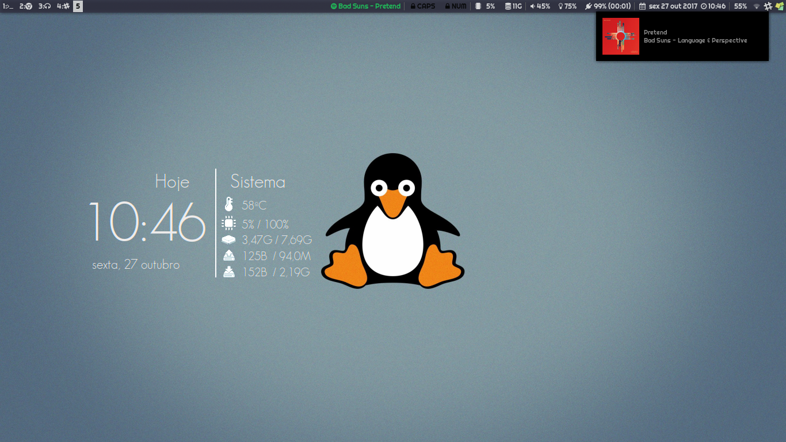
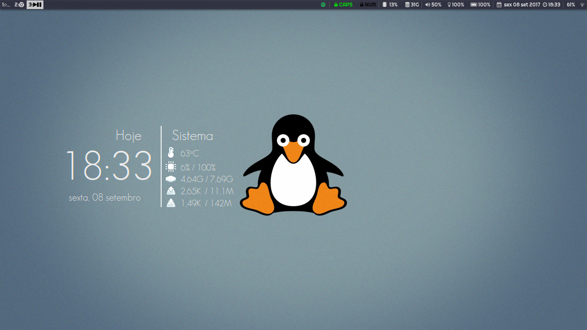

# My i3 config
This is my configuration for i3wm, a tiling window manager.

Fonts used:

 * Font-Awesome
 * Righteous (google fonts)
 * Geosans
 * GeosansLight

Software:

 * i3-gaps, i3lock, i3blocks
 * scrot, rofi, feh
 * pulseaudio
 * xbacklight
 * conky
 * compton
 * unclutter
 * playerctl
 * redshift
 * dunst
 * gawk

## Screenshots

## Note:
	In order to prevent power key from shutting down the system, 
	I edited the file /etc/systemd/logind.conf
	uncommented #HandlePowerKey=poweroff line and changed it to
	HandlePowerKey=ignore